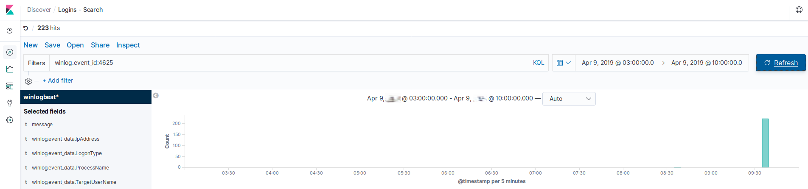
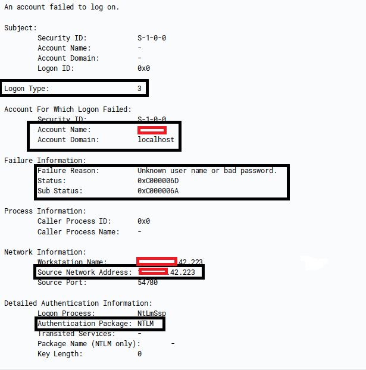
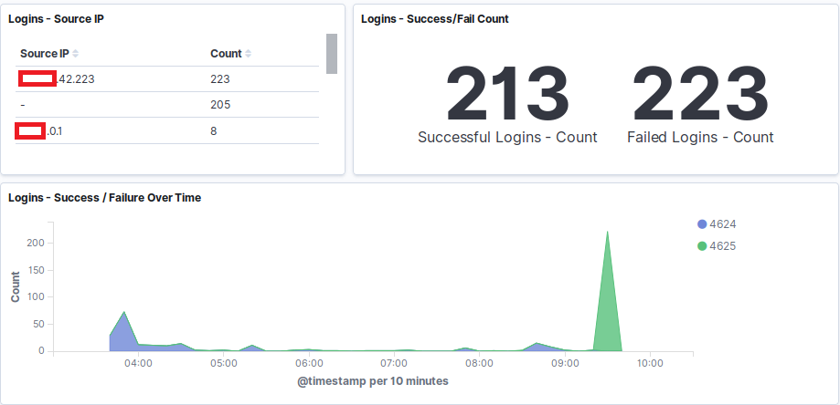
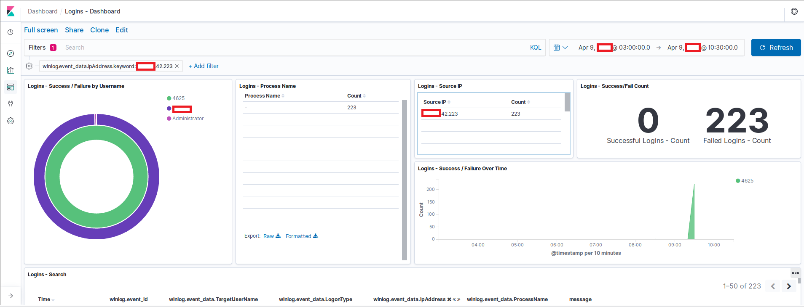

# Windows Log Analysis — Brute Force Detection

## Objective
Analyze Windows Security Event Logs to detect potential brute-force login attempts.  
Focus is on **identification** of suspicious authentication patterns, not remediation.

## Environment
- Windows endpoints sending security logs to a central collector
- Analysis performed in a log visualization platform (e.g., Kibana / Elastic)
- All data and screenshots are sanitized

## Analysis Approach
1. Reviewed failed logon events across multiple accounts.
2. Grouped events by **source IP** and **username** to identify patterns.
3. Visualized the number of failed logins over time to detect bursts of activity.
4. Compared failed logon activity to successful logins to determine attack behavior.

## Key Findings
- Rapid, repeated failed login attempts from a single source IP.
- Single user account targeted in a short timeframe.
- No successful logins occurred during the same period from the suspicious IP due to wrong password.
- Pattern strongly indicates a brute-force attack attempt.

## Screenshots
| Visualization | Description |
|---------------|-------------|
|  | Time-series chart showing spike in failed logins |
|  | 4625 - Failed login - log description |
|  | Login events |
|  | Visualization of ip with failed login events and targeted account |

## Artifacts
- `event_summary.md` — chronological summary of identified events
- `analysis_notes.md` — step-by-step process and observations
- Screenshots as above

## Skills Demonstrated
- Log filtering and triage
- Pattern recognition and incident identification
- Visualization of authentication events for SOC analysis
- Documentation of findings in a professional format

## MITRE ATT&CK Mapping
- **T1110 – Brute Force**
- **T1078 – Valid Accounts (if successful logins are observed)**

---

**Disclaimer:** All work is performed in an isolated lab. All logs and screenshots are sanitized. No third-party networks, services, or proprietary course materials are included.
